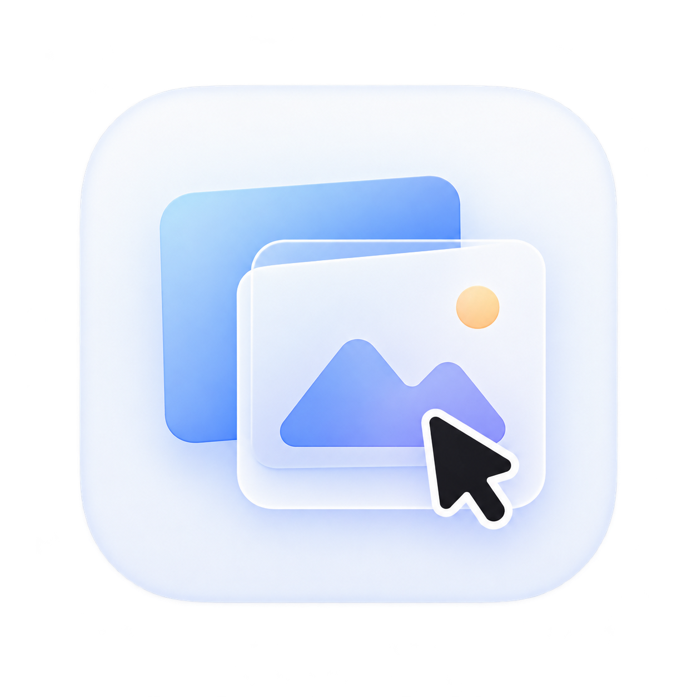
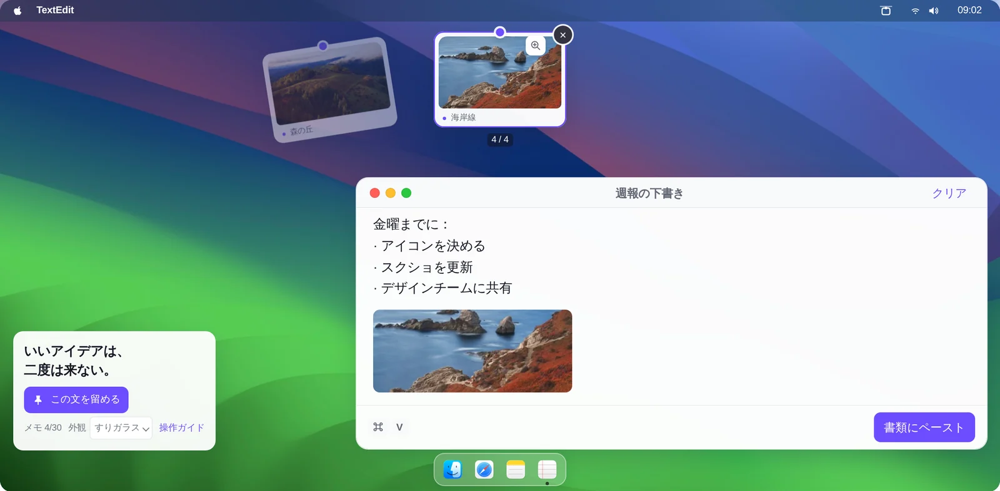
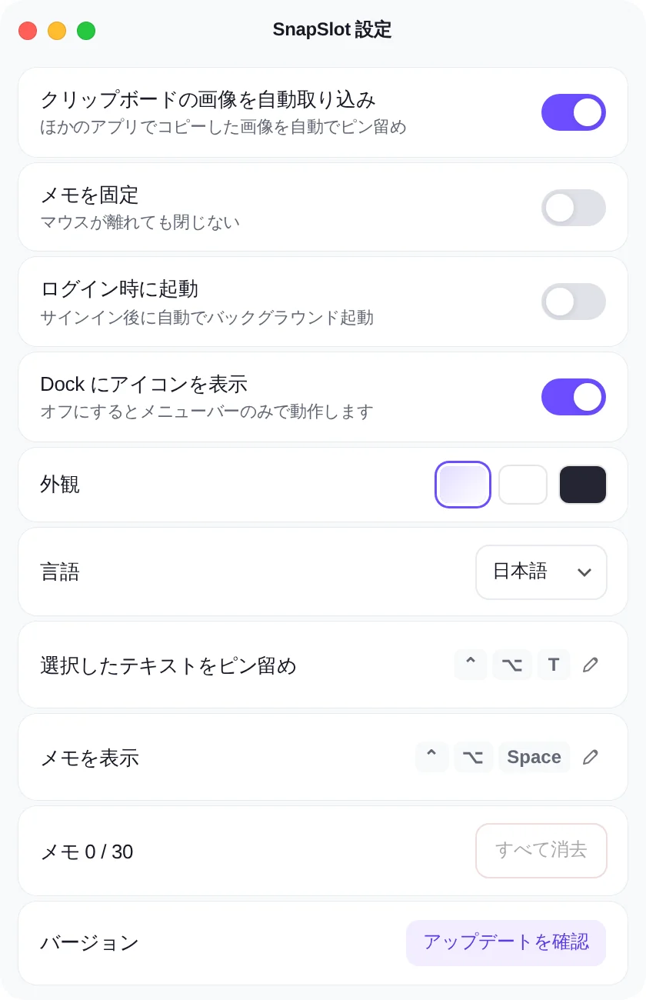

<!-- Generated by scripts/readme-build.py — edit that file, not this one. -->
<p align="center"></p>

<h1 align="center">SnapSlot</h1>

<p align="center"><b>大切なものを、いつでも目の前に。</b><br>画像や文字を画面の手前に。参考資料や思いついたアイデアを、いつでも見える場所へ。</p>

<p align="center">
  <a href="https://github.com/LING-0001/SnapSlot/releases/download/v1.1.4/SnapSlot-1.1.4-macOS-universal.dmg"><b>macOS 版をダウンロード</b></a> ·
  <a href="https://github.com/LING-0001/SnapSlot/releases/download/v1.1.4/SnapSlot-1.1.4-windows-x64-setup.exe"><b>Windows 版をダウンロード</b></a> ·
  <a href="https://snapslot.linglinglab.top/ja/">オンラインで試す</a>
</p>

<p align="center"><a href="../../README.md">简体中文</a> · <a href="README.en.md">English</a> · <a href="README.zh-Hant.md">繁體中文</a> · <b>日本語</b> · <a href="README.ko.md">한국어</a> · <a href="README.es.md">Español</a></p>

<p align="center"><a href="https://raw.githubusercontent.com/LING-0001/SnapSlot/3acfb51da6943208ec47fc4990d637346b217893/docs/media/ja/demo.mp4"></a></p>
<p align="center"><sub><a href="https://raw.githubusercontent.com/LING-0001/SnapSlot/3acfb51da6943208ec47fc4990d637346b217893/docs/media/ja/demo.mp4">デモを見る</a> · <a href="https://raw.githubusercontent.com/LING-0001/SnapSlot/3acfb51da6943208ec47fc4990d637346b217893/docs/media/ja/demo.gif">GIF を見る</a> · <a href="https://github.com/LING-0001/SnapSlot/releases/tag/v1.1.4">v1.1.4</a> · <a href="../../docs/releases/hosting.md">インストール方法</a></sub></p>

## 使いかた

1. **上端で、少し止まる**<br>
   画面のいちばん上で 0.5 秒止まるとメモが扇形に下りてきます。下に外すと閉じ、ホイールで切り替えられます。`N` でクイックメモ作成、`Space` で拡大・テキスト編集・オフライン OCR 文字抽出、`F` で独立フローティング付箋（拡大縮小・透過度切替対応）にできます。
2. **テキスト選択や上端ドロップで取り込む**<br>
   コピー可能なテキストを選んで `⌃ ⌥ T`（Windows：`Ctrl + Alt + T`）でメモ化・コピーできるほか、画像・テキスト・ファイルを画面上端へドラッグしても取り込めます。複数ディスプレイ間で共有され、重複は自動整理されます。
3. **ドラッグやクリックですぐ使う**<br>
   クリックでコピーできるほか、対応アプリやフォルダーに PNG または TXT としてドラッグできます。

## メニューと設定

macOS ではメニューバーのアイコンをクリックするか、Dock アイコンを右クリックして設定・自動取り込み・メモの固定を操作できます。Windows ではトレイメニューを使います。設定から外観・言語・ショートカット、ログイン時起動、macOS Dock 表示、メモ消去、手動アップデート確認ができます。

<p align="center"></p>

## ショートカット

| 操作 | macOS | Windows |
| --- | --- | --- |
| メモを表示 / 隠す | <kbd>⌃</kbd> <kbd>⌥</kbd> <kbd>Space</kbd> | <kbd>Ctrl</kbd> <kbd>Alt</kbd> <kbd>Space</kbd> |
| 選択テキストをピン留め | <kbd>⌃</kbd> <kbd>⌥</kbd> <kbd>T</kbd> | <kbd>Ctrl</kbd> <kbd>Alt</kbd> <kbd>T</kbd> |
| メモを拡大して読む | <kbd>Space</kbd> | <kbd>Space</kbd> |
| クイックメモ / フローティング表示 | <kbd>N</kbd> / <kbd>F</kbd> | <kbd>N</kbd> / <kbd>F</kbd> |
| 選ぶ / コピー / 削除 / 閉じる | <kbd>←</kbd> <kbd>→</kbd> / <kbd>Enter</kbd> / <kbd>Delete</kbd> / <kbd>Esc</kbd> | <kbd>←</kbd> <kbd>→</kbd> / <kbd>Enter</kbd> / <kbd>Delete</kbd> / <kbd>Esc</kbd> |

表は初期設定です。設定でショートカットをクリックし、新しいキーの組み合わせを押すと変更できます。起動時と設定を開いたときに両方の競合を確認し、検出した競合と代替キーを先に表示します。記録中も他のアプリは動作します。Mac でアクセシビリティ権限が必要なのは選択テキストの収集時だけです。一部の共有登録は検出できない場合があります。

## プライバシー

新しくコピーした画像を自動で取り込みます。テキストはショートカット、上端ドロップ、またはクイックメモ入力時だけ取り込みます。メモと OCR はすべて端末内で処理され、アップロードしません（手動アップデート確認時のみ GitHub Releases を参照します）。最大30件で、上限時は最も古いメモを削除し、通常終了時にセッションを消去します。

## 開発と貢献

<details>
<summary>ソースからビルド · リポジトリ構成 · テスト</summary>

### ソースからビルド

```bash
# Web サイト
npm ci --prefix apps/website
npm run dev --prefix apps/website
```

```bash
# macOS（Command Line Tools、Node.js 22+）
./scripts/build-macos.sh
open artifacts/macos/SnapSlot.app
```

```powershell
# Windows（.NET 10 SDK、Node.js 22+）
.\scripts\build-windows.ps1
.\artifacts\windows\win-x64\SnapSlot.exe
```

上の DMG / Setup インストーラーからインストールできます。正式な Mac 版は Developer ID で署名され、Apple の公証を受けています。初回起動の確認が表示される場合があります。ソースビルドは開発用の ad-hoc 署名です。[公開・配信ガイド](../../docs/releases/hosting.md)を参照してください。

### リポジトリ構成

| | |
| --- | --- |
| `apps/website` | 6 言語のサイトとインタラクティブデモ |
| `apps/native-ui` | 両クライアント共通の扇形メモ・メニュー・設定 |
| `apps/windows` | Windows クライアント（C# / WPF + WebView2） |
| `apps/macos` | macOS クライアント（Swift / AppKit + WKWebView） |
| `docs` | 現在の仕様、テスト項目、README 画像 |

### テスト

ビルド、自動テスト、実機確認のコマンドは [CONTRIBUTING.md](../../CONTRIBUTING.md) と `docs/native-testing.md` を参照してください。

Issue と PR を歓迎します。一つの要件に沿ってコミットをまとめ、対象プラットフォーム、動作の変更、実際の検証を記載してください。詳細は [CONTRIBUTING.md](../../CONTRIBUTING.md)（中国語）。

</details>

## ライセンス

コードは MIT ライセンスです。名前とアイコンは MIT の対象外です。[BRANDING.md](../../BRANDING.md) を参照。

[GitHub Issues](https://github.com/LING-0001/SnapSlot/issues) · [コントリビュート](../../CONTRIBUTING.md) · [e1347605313@gmail.com](mailto:e1347605313@gmail.com)
